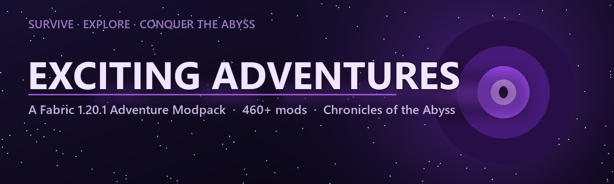

  

<h1 align="center">Exciting Adventures</h1>

  <b>A story-driven Fabric 1.20.1 adventure modpack.</b> 
  Wash up on a cold shore with no memory, carve a life out of a hostile world, and follow the call of the <i>Abyss</i> to its end.

  
  
  
  

  
  
  

---

## ⚔️ About

**Exciting Adventures** is a hand-curated Fabric **1.20.1** modpack built around one idea: every run should feel like a *journey*. It blends rich worldgen, structures and dungeons with deep combat, magic, cozy building and an RPG progression layer — then ties it all together with a full narrative questline, **Chronicles of the Abyss**.

Whether you want to explore ruins, master enchanted blades, brew potions, build a homestead through the seasons, or descend into the dark to face what waits there — the pack is designed to give you a reason to keep going.

> Survive the cold shore · Explore a reworked world · Conquer the Abyss.

## ✨ Highlights

- 🗺️ **Vast exploration** — overhauled biomes, new structures, dungeons and bosses to discover in every direction.
- ⚔️ **Deep combat** — directional Better Combat, unique Simply Swords & Epic Knights arsenals, Immersive Armors sets, and genuinely dangerous bosses.
- 🔮 **Magic & rituals** — Spectrum and Bewitchment bring spellcraft, altars and dark pacts.
- 🌾 **Cozy & build** — the full *Let's Do* series, Farmer's Delight, Create and seasons for a living, breathing world.
- 🎭 **RPG identity** — Origins, Origins Classes and skill systems let you define *who* you are.
- 📖 **A real story** — a written campaign with branching choices that change your ending (see below).
- ⚡ **Performance-first** — Sodium, Lithium, FerriteCore, ModernFix and more, plus Distant Horizons & Iris shader support.

## 📖 Chronicles of the Abyss

The pack ships with a complete, hand-written questline that doubles as the spine of your playthrough — **Chronicles of the Abyss**.

- **Seven chapters** of FTB Quests, from your first night on the shore to the final seal.
- **The story lives in the world**, not just the quest book: a guide codex and a starting letter, atmospheric narration as you descend into the Deep Dark, enter the Nether and the End, and fell the great bosses — all surfaced as beautiful advancement milestones.
- **NPCs with dialogue** — meet the *Hermit of the Shore* and the *Herald of the Abyss*, talk to them, and make a choice.
- **Your choice changes the ending.** Will you **seal** the Abyss as its Keeper, or **embrace** its power as its new Herald? Two distinct finales await.

*(A spoiler-light overview lives in the [Wiki](../../wiki).)*

## 🧩 What's Inside

A taste of the 460+ mods, by theme:

| Theme | Featured mods |
|-------|---------------|
| **Exploration & Structures** | YUNG's Better Dungeons/Temples, Aquamirae, Additional Structures, Regions Unexplored, Dungeons and Taverns, Repurposed Structures, Waystones, Nature's/Explorer's Compass |
| **Combat & Bosses** | Better Combat, Simply Swords, Epic Knights, Immersive Armors, Bewitchment, Brutal Bosses, Eldritch Mobs |
| **Magic** | Spectrum, Bewitchment |
| **Farming & Building** | Create, Farmer's Delight, the *Let's Do* series (Bakery · Vinery · Brewery · Beachparty), Expanded Delight, Fabric Seasons |
| **RPG & Identity** | Origins, Origins Classes, Medieval Origins, RPG Origins, Puffish Skills |
| **Quality of Life** | FTB Quests/Chunks/Ultimine, Xaero's Minimap & World Map, Tom's Storage, Jade, JEI/EMI, AppleSkin, Inventory Profiles Next |
| **Performance & Visuals** | Sodium (+Extra), Lithium, FerriteCore, ModernFix, Entity/More Culling, Distant Horizons, Iris Shaders, FancyMenu |

## 🚀 Installation

**The easy way — a launcher (recommended):**

1. Install the [CurseForge App](https://www.curseforge.com/download/app) or [Prism Launcher](https://prismlauncher.org/).
2. Search for **Exciting Adventures** (or import from [CurseForge](https://www.curseforge.com/minecraft/modpacks/exciting-adventures) / [Modrinth](https://modrinth.com/modpack/exciting-adventures)).
3. Install, set your RAM (see below), and launch.

**Manual (Prism / MultiMC):** download the pack zip from CurseForge/Modrinth and *Add Instance → Import from zip*.

## 🖥️ Recommended Specs

| | Minimum | Recommended |
|---|---|---|
| **RAM allocated** | 6 GB | **8 GB** |
| **Java** | 17 | 17 |
| **Loader** | Fabric 0.16+ | Fabric 0.16.14 |

> Allocate RAM in your launcher (no more than ~8 GB — Minecraft rarely benefits from more). Distant Horizons and shaders are GPU-heavy; turn them down on weaker machines.

## 🔗 Links

- 🟠 **CurseForge:** https://www.curseforge.com/minecraft/modpacks/exciting-adventures
- 🟢 **Modrinth:** https://modrinth.com/modpack/exciting-adventures
- 💬 **Discord:** https://discord.gg/c57BX45vkN
- 📚 **Wiki:** [Documentation & guides](../../wiki)
- 🐛 **Issues:** [Report a bug](../../issues/new/choose)

## 🤝 Credits & License

**Exciting Adventures** is created and maintained by **denfry**.

This pack is a *configuration* — every mod, library and asset belongs to its respective author and is bundled under its own license. Huge thanks to the entire Fabric modding community whose work makes this pack possible.

The pack's own configuration, quests and scripts are © denfry. Please don't re-upload the pack as your own; link back here or to the CurseForge / Modrinth pages instead.

---

<i>The cold shore remembers you. Will you answer the Abyss?</i>

